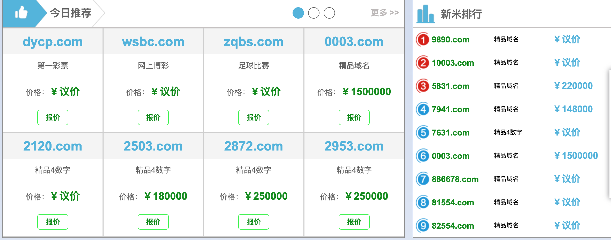

环境要求：
=====

### 

* Ubuntu Chromedriver Selenium BeautifulSoup

检测流程：
=====

### 1\. 模拟Chrome浏览器打开网页，默认为HEADLESS模式以及不加载图片（可在settings.py中修改）

### 
2\. 若该页面中含有\<frame\>标签，则用BEAUTIFULSOUP解析标签获得框架内url，继续用Chrome进入对应页面

### 
3\. 待页面加载完毕后，

* 先根据跳转后的最终URL，判断URL的特征是否疑似域名售卖URL，匹配成功返回True，不成功则向下继续流程（例如godaddy ename.org yuming hugedomains等关键字）

* 再根据页面关键词匹配，判断是否为非法域名，原因为赌博类页面和域名售卖页面有大量重复关键词，若不经过此道判断，会误判许多非法赌博页面为域名售卖页面。若出现超过10个非法关键词（为提高准确率）且页面不含表格，返回False，不成功则向下继续。

* 最后根据页面关键词匹配，判断是否为售卖页面，匹配成功返回True，否则False

4\. 销毁浏览器释放资源，继续检测下一个页面

\#例如下图，该页面中有大量赌博类关键词，解决方案为统计page\_source.count(“\<td”)，若数值超过200则不认定该页面为赌博类页面

